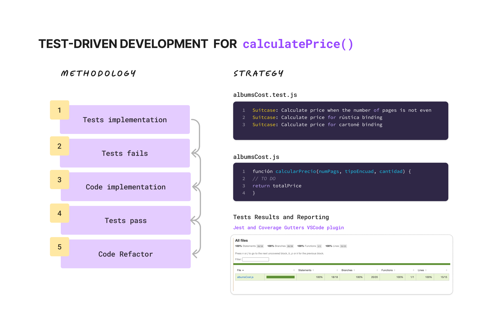

# SoprAlbum - Testing

This project is a simulation of Test-Driven Development (TDD), where I test the functionality of calculating the price of an album based on specific client requirements. The pricing logic takes into account factors such as the number of pages, type of binding, and quantity, ensuring that the system behaves as expected through predefined test cases. The goal is to incrementally develop robust code by first writing tests, then implementing functionality to pass those tests, while continuously refactoring and improving the solution.
[Briefing](https://docs.google.com/document/d/17n8jQNq7DuQ4UOr0jD0KxufPR3Zo27Qs4LveTEFHUwY/edit?tab=t.0)

## Installation

1. Clone the repository.
2. Install dependencies using:

```bash
npm install
```

## Usage

To run tests with jest you can use one of these two commands:

```bash
npm run test
```

```bash
npm run test:coverage
```

## Testing Methodology and Strategy



## Test Requirements

### Pricing Model

- Initial price (20 pages):
  - Rustic binding: **€20.00**
  - Case binding: **€30.00**
- Additional price per 2 extra pages:
  - Rustic: **€0.70**
  - Case: **€1.00**

#### Discounts for bulk orders:

- **1-4 units:** No discount.
- **5-9 units:** 10% discount.
- **10-250 units:** 25% discount.
- **Above 250 units:** Orders are not accepted.

### Parameters

- `numPags`: An integer representing the album's page count.
- `tipoEncuad`: A string representing the binding type, either "R" for rustic or "C" for case.
- `cantidad`: The number of copies ordered.

Additionally, **all inputs and outputs** are received as strings, meaning incorrect formats and null values could be encountered.

## Test Cases Breakdown

Here is a detailed breakdown of the test cases written to ensure the functionality:

**Suitcase: Calculate price when the number of pages is not even**

- **Case 1**: Should return undefined when the number of pages is odd and binding is rustic.
- **Case 2**: Should return undefined when the number of pages is odd and binding is case.

**Suitcase: Calculate price for rustic binding**

- **Case 3**: Should return 20.00 € when number of pages is 20.
- **Case 4**: Should return 20.07 € when number of pages is 22.
- **Case 5**: Should return 21.40 € when number of pages is 24.
- **Case 6**: Should return 44.20 € when order 2 units and number of pages is 26.
- **Case 7**: Should return undefined when number of pages is 120.
- **Case 8**: A 10% discount is applied for an order of 5 units.
- **Case 9**: A 25% discount is applied for an order of 10 units.
- **Case 10**: A 25% discount is applied for an order of 250 units.
- **Case 11**: Should return undefined for 260 units orders.

**Suitcase: Calculate price for case binding**

- **Case 12**: Should return 30 € when number of pages is 20.
- **Case 13**: Should return 31 € when number of pages is 22.
- **Case 14**: Should return 32 € when number of pages is 24.
- **Case 15**: Should return 66 € when number of pages is 26.
- **Case 16**: Should return undefined when number of pages is less than 20.
- **Case 17**: Should return undefined when number of pages is 130.
- **Case 18**: A 10% discount is applied for an order of 5 units.
- **Case 19**: A 25% discount is applied for an order of 10 units.
- **Case 20**: A 25% discount is applied for an order of 250 units.
- **Case 21**: Should return undefined for 260 units orders.

## Reporting and Additional Resources

If you'd like to learn more about the SoprAlbum calculate price TDD process, feel free to visit this [link](https://drive.google.com/file/d/1RKOjvEzNXn8uF7vGO2nZ-0WVcTG7az4V/view?usp=sharing) or check out the [FigJam](https://www.figma.com/board/K2UCMwwdY7JsmcJDFU5tF6/SoprAlbum-Testing?node-id=0-1&t=fsxOiwF7r4mFlnCW-1), where I've documented various stages of the project.

---
